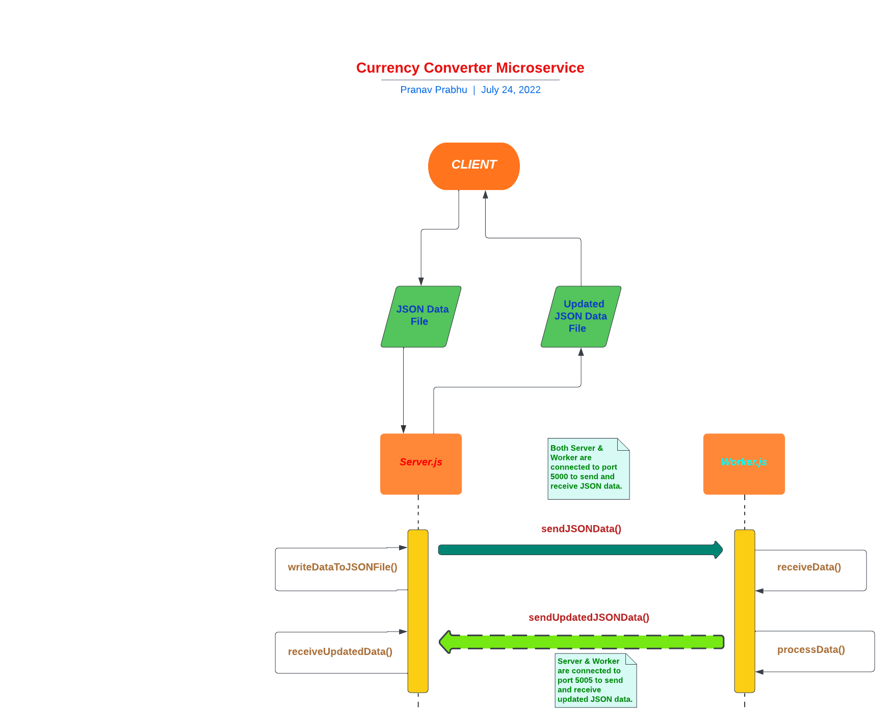

# Currency-Converter
This repository contains the source code for my "Currency Converter" program written using HTML, CSS, and JS. All currency data is fetched from a public API which will update daily currency exchange rates.

 

## Communication Contract

<b>Note 1: I implemented a curency converter microservice based on the number of stocks for my partner's individual project on "Stock Currency Converter".</b>

<b>Note 2: I used my Individual Project to provide a microservice to my partner's "Stock Currency Converter" program.</b>

<b>Note 3: The communication pipeline used for requesting and receiving data is ZeroMQ.</b>

<b>Note 4: There are two Node JS files used to receive, process, and return the JSON data - Server.js and Worker.js.</b>

<b>Note 5: Server.js will read in the incoming JSON file and send it over to Worker.js to process the data, which will then write the result to Stock.json.</b>

<h3>Requesting Data</h3>
<ol>
  <li>Server.js will be connected to port 5000 and the user hits enter to send the JSON data over to Worker.js.</li>
  <li>Worker.js will also be connected to port 5000 to request data from Server.js where it will also print currency data obtained from a public API.</li>
  <li>Once the JSON data has been fetched from Server.js, Worker.js will connect to port 5005 to process the data (convert between currencies).</li>
  <li>Once processed, Worker.js will returned the new JSON file via port 5005 and Server.js will request the updated JSON file via the same port.</li>
  <li>Server.js requests and receives the updated JSON file via port 5005 to be sent to the client later.</li>
</ol>

<h3>Receiving Data</h3>
<ol>
  <li>Initially, Server.js requests the JSON data from the client over the network and once fetched, it will downloaded and processed to be sent to Worker.js via port 5000.</li>
  <li>Worker.js receives the JSON file from Server.js via port 5000 where the currency conversion will take place.</li>
  <li>Worker.js requests and receives currency data in JSON format from ExchangeRate's public API.</li>
  <li>Once the data is processed, the resulting JSON data is sent to Server.js.</li>
  <li>Finally, Server.js receives and writes the JSON data to a JSON file, which is then sent over the network to the client.</li>
</ol>

<h3>Example Call</h3>

<b>NOTE: The left side of the arrows below is the terminal command and the right side of the arrows is the actual output.</b>
 
<ol type="A">
	<li>On tab 1 of your terminal, run the following code: `node server.js`.</li>
	<ol>
		<li>node server.js   --->   prints "Server is ready and listening on port 5000. Press any key to start sending the stock data!"</li>
	</ol>
	<li>On tab 2 of your terminal, run the following code: `node worker.js`.</li>
	<ol>
		<li>node worker.js   --->   prints "Connected to port 5000! Server is ready and listening on port 5005! Press any key to start sending the JSON data."</li>
	</ol>
	<li>On tab 1 of your terminal, press enter to send the JSON data.</li>
	<li>JSON data is received and printed in tab 2 of your terminal.</li>
	<li>Press enter in tab 2 of your terminal to send the "Updated JSON Data".</li>
	<li>Press enter twice in tab 1 of your terminal to print the updated JSON data.</li>
</ol>

<h3>UML Sequence Diagram</h3>

